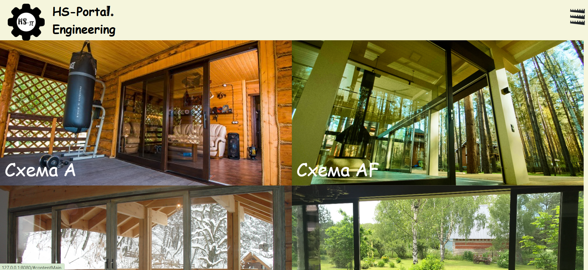

# ХС-Портал.Инжиниринг
Вебсайт для компании-производителя раздвижных дверей.
## Меню
В верхнем правом углу есть меню, где предоставлены следующие возможности:
- Выбрать схему
- Узнать подробнее о компании
- Войти в личный кабинет или зарегистироваться
- Рассчитать стоимость понравившейся схемы
## На главной странице:
- Фотографии с доступными схемами
- Нажимая на любую схему, Вы попадаете на страницу с подробным ее описанием, видео и отзывами

---
## Автор
* [Дуброва Анфиса](https://github.com/Anfisa2209)
## Установка
1. Создайте новое виртуальное окружение
2. Установите все зависимости `pip install -r requirements.txt`
## Запуск
Для запуска введите в терминал: `python main.py`

